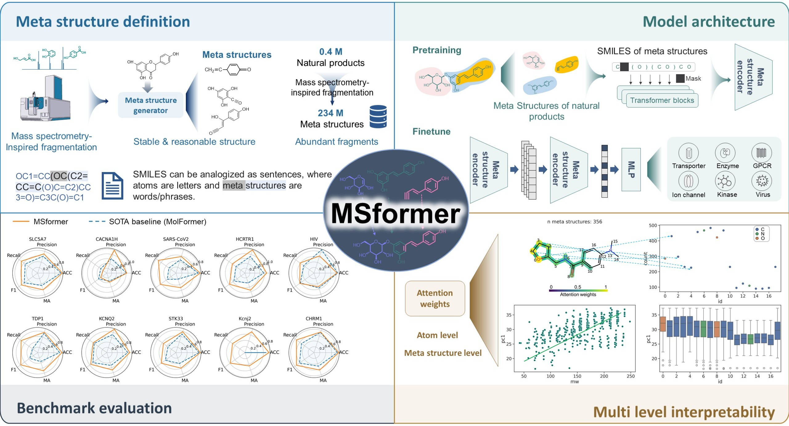

# MSformer: Meta Structure-based Molecular Representation Learning

[](https://www.python.org/)

### Bridging Natural Products and AI-driven Drug Discovery
Natural products (NPs) represent evolutionary-optimized bioactive scaffolds, yet their structural complexity challenges modern AI frameworks. MSformer revolutionizes NP analysis through:

🔬 **Mass Spectrometry-inspired Fragmentation**  
⚛️ **Transformer-based Hierarchical Encoding**  
💊 **Drug-like Bioactive Fragment Identification**

Pretrained on 400,000 NPs deconstructed into 234 million meta structures, MSformer captures stereochemical richness while enabling:

✅ State-of-the-art performance on 14 MoleculeNet/TDC benchmarks  
✅ Interpretable fragment-level attribution  
✅ Bioactive scaffold discovery from approved drugs


# Install
### System Requirements
- NVIDIA GPU with CUDA 11.7
- 20GB+ GPU memory (RTX 4090/A100 recommended)

[](https://github.com/rdkit/rdkit) [](https://github.com/scipy/scipy) [](https://github.com/pytorch/pytorch) [](https://github.com/numpy/numpy) [](https://github.com/pandas-dev/pandas) [](https://github.com/idiap/fast-transformers) [](https://github.com/scikit-learn/scikit-learn) [](https://github.com/Lightning-AI/pytorch-lightning)

### Conda Environment Setup
```bash
conda create -n msformer python=3.8 -y
conda activate msformer

# Install PyTorch with CUDA 11.7
pip install torch==1.13.1+cu117 --extra-index-url https://download.pytorch.org/whl/cu117

# Install core dependencies
cd msformer-main
pip install -r requirements.txt
```

# Usage
1 meta structure generation
```
from masskg import *
molecules = ['O=C(OC1C(O)C(O)C(OC1OC2(OC(CO)C(O)C2O)CO)CO)C3=CC(O)=C(O)C(O)=C3','OCC1OC(OC2C(O)C(OC)OC(COC3OCC(O)C(O)C3O)C2O)C(O)C(O)C1O']
frag_smiles = [fragments_generation(x) if len(x)<=202 else set(x) for x in molecules]
```
A pre-trained model can be downloaded from Google drive [Google Drive](https://drive.google.com/file/d/1Bkq_vIow80VTLHZ_rWQl_QBggWcfPAeU/view?usp=drive_link). Then experiments can be excuated based on this model.
```
# finetune on MoleculeNet and TDC tasks
. run_classification_tdc.sh
. run_classification_molnet.sh
```
3 visulization of attention weights
```
from visulization import processed_data,generate_visualization
sns.set_theme(rc={"figure.dpi": 300,
                  'figure.figsize': [6,4],
                  'legend.fontsize': 12,
                  'axes.labelsize': 18.0,
                  'xtick.labelsize': 16.0,
                  'ytick.labelsize': 16.0},
              style="ticks")
processed_data = process_attention_data('datasets/sampled_tdc/knn3/cav3_t-type_calcium_channels_butkiewicz/fragtest.csv',
                  'tdc/hts/checkpoints_cav3_t-type_calcium_channels_butkiewicz/attention/results/attention_weights.npy',
                  'O1C(CCC1)CNC(=O)c1ccc(N(C)C)cc1')
fig = generate_visualization(processed_data)
```


# Data availability 
We offered the source data of finetune tasks, users can process the source data follow [data_process.ipynb]().
## 📁 Datasets

To ensure full reproducibility, the exact versions of the datasets used in this study are listed below.

| Dataset | Version / Download Date | Source Link | Notes |
|---------|-------------------------|-------------|-------|
| **COCONUT** | 2022 | [COCONUT Download](https://coconut.naturalproducts.net/download) | Used for pre-training. Contains over 400,000 natural product structures. |
| **MoleculeNet** | 2017 | [MoleculeNet](https://moleculenet.org/datasets-1) | Used for downstream task evaluation (BBBP, Tox21, ClinTox, BACE, SIDER). |
| **TDC** | 0.4.1 (Released in 2023) | [TDC Documentation](https://tdcommons.ai/) | Used for downstream HTS evaluation. Datasets: `CACNA1H`, `Kcnj2`, `CHRM1`, `HCRTR1`, `SLC5A7`, `KCNQ2`, `STK33`, `TDP1`, `SARS-CoV-2`, `HIV`. |


# Cite
Zhu B, et al. Anal Chem. 2025. [PMID:41201272](http://pubs.acs.org/doi/abs/10.1021/acs.analchem.5c03958)

Should you have any questions, please contact Bingjie Zhu at zhubj@zju.edu.cn
